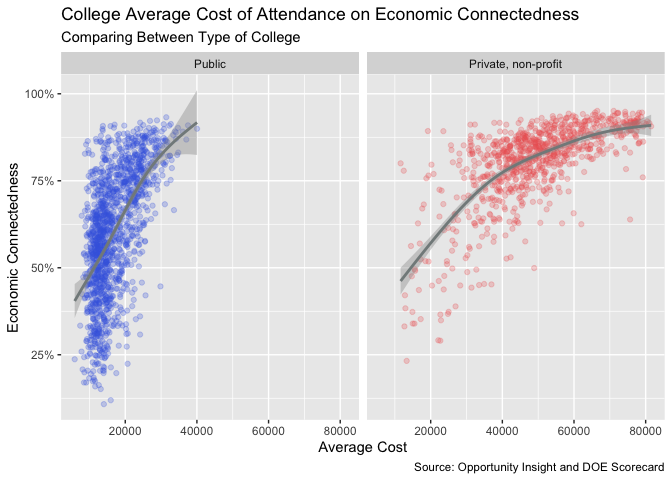

Economic Connections At Colleges
================
Quinn Liu

- [The Data](#the-data)
  - [Description of the Data Sets](#description-of-the-data-sets)
  - [Retrieving and Cleaning the
    Data](#retrieving-and-cleaning-the-data)
  - [Interest of the Data](#interest-of-the-data)
- [Exploring the Data](#exploring-the-data)
  - [Private vs Public Colleges](#private-vs-public-colleges)
    - [Exposure](#exposure)
    - [Friending Bias](#friending-bias)
    - [Admission Rates](#admission-rates)
    - [Average Cost of Attendance](#average-cost-of-attendance)
  - [Colleges with Focused
    Demographics](#colleges-with-focused-demographics)
    - [Historically Black College and
      University](#historically-black-college-and-university)
    - [Women’s Colleges](#womens-colleges)
- [Summary](#summary)

## The Data

#### Description of the Data Sets

[Opportunity
Insights](https://data.humdata.org/dataset/social-capital-atlas) has a
data set on social capital, collecting data on friendships using
privacy-protected data from Facebook. They explore the degree to which
high-income and low-income people are friends with one another. They
have used economic connectedness, cohesiveness, and civic engagement as
measures of social capital and have collected data across counties, ZIP
codes, high schools, and colleges. I have chosen to specifically explore
colleges and economic connectedness. Economic connectedness (EC) is the
share of high-income friends among low-income individuals.

I decided to combine this data set with another data set to combine
social capital with other characteristics like private/public and
admission rates to explore what characteristics are most correlated with
higher economic connectedness. While the `rcis` library has the
`scorecard` data set that provides the Department of Education’s College
Scorecard data, I found and used the full spreadsheet of the DOE’s
[Scorecard data](https://collegescorecard.ed.gov/data/) to both obtain
both more colleges and more variables that were not in the `rcis` data.
This allowed me to retain most of the social capital data.

#### Retrieving and Cleaning the Data

I retrieved the two data sets and joined them. The social capital data
has 2586 observations, and the combined data set has 2571 observations,
losing only 15 observations. And after cleaning out data for NA economic
connectedness values, the data set used in general has 2351
observations.

    ## # A tibble: 6 × 12
    ##   college…¹    ec expos…² clust…³ bias_o…⁴ volun…⁵ type  is_hbcu is_wo…⁶ adm_r…⁷
    ##   <chr>     <dbl>   <dbl>   <dbl>    <dbl>   <dbl> <fct>   <int>   <int>   <dbl>
    ## 1 Alabama … 0.428   0.423   0.245 -0.012    0.0326 Publ…       1       0   0.716
    ## 2 Faulkner… 0.655   0.619   0.408 -0.0581   0.0334 Priv…       0       0   0.646
    ## 3 Universi… 0.712   0.708   0.309 -0.00504  0.0957 Publ…       0       0   0.901
    ## 4 Alabama … 0.390   0.376   0.232 -0.0366   0.0215 Publ…       1       0   0.980
    ## 5 Central … 0.364   0.383   0.341  0.0501   0.0292 Publ…       0       0  NA    
    ## 6 Athens S… 0.662   0.638   0.249 -0.0376   0.0553 Publ…       0       0  NA    
    ## # … with 2 more variables: UGDS <chr>, avg_cost <dbl>, and abbreviated variable
    ## #   names ¹​college_name, ²​exposure, ³​clustering_college, ⁴​bias_own_ses_college,
    ## #   ⁵​volunteering_rate_college, ⁶​is_women_only, ⁷​adm_rate

#### Interest of the Data

From [Opportunity Insight’s report and analysis by Chetty et
al. (2022)](https://opportunityinsights.org/wp-content/uploads/2022/07/socialcapital_nontech.pdf),
the data on social capital by county show that children from communities
with higher economic connectedness are more likely to rise out of
poverty. They obtained data on social capital by country and also
followed up on data collection to obtain outcome measures to determine
economic mobility. Outcome data was not obtained for colleges, but it
can be weakly extrapolated that low-income students who have higher
economic connectedness at college will have greater economic success. It
is a common sentiment, particularly expressed by those involved in the
college admission process, that one of the benefits of elite (often
private) colleges is the networking and connections you are able to
make. “It’s not what you know, but who you know.” And you get to know
more rich and connected people at elite private colleges. The interest
of this data set is to validate if indeed elite private colleges provide
better economic connections and what are kind of characteristics high
economic connectedness colleges have.

## Exploring the Data

**Main Question: What kind of college tends to have the highest economic
connectedness? How do private and public colleges compare?**

#### Private vs Public Colleges

<!-- -->

From the histograms and density curves, it can be seen that private,
for-profit colleges have a greater density of colleges with higher
economic connectedness. A greater percentage of private, non-profit
colleges have high economic connectedness than the other two types.
Private, non-profit colleges generally cluster around 80% with a heavy
negative skew, while private, for-profit clusters around 65%. Public
colleges appear to be bimodal, with its largest mode around 60% and a
second mode around 75%. Private, non-profit colleges are the most likely
type of college to have a high economic connectedness.

The mean economic connectedness for private, non-profit is 80.3%, while
it is 60.4% for public colleges and 63.4% for private, for-profit
colleges. This tells us that on average, a low socioeconomic status
student at a private, non-profit college has a greater percentage of
high socioeconomic status friends than their other two counterparts.
Indeed, it does seem that private colleges provide more economic
connections,

Private, for-profit colleges’ sparse distribution is due to a lack of
observations. Private, for-profit colleges are less common than their
counterparts, and in general, do not have the same regard in public
sentiment. Of the 2351 observations, only 36 were private, for-profit.
This limits the analysis possible for private, for-profit colleges, but
we can still see that its distribution is closer to that of public
colleges than private, non-profit colleges.

##### Exposure

My conjecture for why private, non-profit colleges have the greatest
proportion of high economic connectedness is that private colleges tend
to cost more and thus have a greater proportion of high-income students.

It can be seen that exposure is the best indicator of economic
connectedness. Exposure is a variable from Opportunity Insight’s Social
Capital data set and is a measure of the share of high socioeconomic
status individuals at a college.

<!-- -->

There is a very strong linear relationship between exposure and economic
connectedness. This occurs across public and private colleges. From
these faceted scatterplots, it can also be seen that private, non-profit
colleges have a greater cluster among high exposure and high economic
connectedness, which is not seen in the other types. This aligns with
the distribution that was seen in the economic connectedness histogram.
This also supports the conjecture that private, non-profit colleges have
higher economic connectedness due to a greater proportion of high-income
students. Colleges with more high-income students allow the low-income
students at these colleges to make more high-income friends due to the
pure fact of who is around to befriend.

Again, private, for-profit does not have a lot of data points. Since
private, for-profit lacks sufficient data, here-on-forth, I will focus
on public and private, non-profit colleges.

##### Friending Bias

Friending bias is a measure of how likely a low-income student is to be
friends with the high-income students they are exposed to, calculated by
dividing economic connected and exposure and then subtracting by 1.

<!-- -->

Across all types, most colleges have a friending bias around 0, meaning
that students are not more likely to make friends with a high-income
person than forming friendships with the general person at their
college. And while both private and public colleges cluster around 0,
private colleges have a greater density at 0, and public colleges have a
slightly more spread out distribution. Public colleges seem to be
slightly more likely to have a positive and a negative bias. General
campus culture could be responsible for the slight differences in
friending bias.

##### Admission Rates

    ## `geom_smooth()` using method = 'loess' and formula = 'y ~ x'

<!-- -->

We can see that across both public and private colleges, there is an
overall negative correlation between the admission rate and economic
connectedness of a college. The lower the admission rate, the higher the
economic connectedness. We can see a small cluster of private colleges
with very low admission rates. This cluster is not observable in public
colleges, and public colleges do not reach the same minimum admission
rate as private colleges. Comparing between private and public colleges,
colleges of similar selectivity have a similar average economic
connectedness. Instead, private colleges’ association with higher
economic connectedness seems to come from these very selective private
colleges. I would conjecture that lower admission rates are correlated
with economic connectivity because selective colleges often have a lot
of resources and attract numerous applications, and richer individuals
are more likely to be able to be admitted and attend.

We can also explore the relationship between the average cost of
attendance and EC.

##### Average Cost of Attendance

    ## `geom_smooth()` using method = 'gam' and formula = 'y ~ s(x, bs = "cs")'

<!-- -->

There is an observable positive correlation between the average cost of
attendance and EC in both private and public colleges. It can also be
seen that public colleges do not exceed `$`40000, while the maximum
average cost for private colleges is twice that. The mean of the average
public college cost is 16898.78, while the mean for private college is
around 49398.96. The average cost can be a measure of who can afford the
college. While low-income students often get substantial financial aid,
middle-class individuals often do not get enough financial aid to afford
expensive colleges. Thus, colleges with high tuition can be a barrier to
middle-class individuals and instead will admit more high-income
students. The barrier for low-income students tends to be less cost and
more a lack of resources to building an impressive college application.
In general, average cost tells us the economic background of the average
student, and the higher the cost, the more high-income individual there
are, and the more economically connected a low-income student will be.

There is a correlation among all these factors: economic connectedness,
exposure, admission rate, and average cost. It is not clear which of
these, if any, causes the other factor, but a high economic connected
college will likely be a selective, expensive, and private college. I
would conjecture that exposure is likely the cause of economic
connectedness of a college, as the relationship shown is very strong.
Admission rate and average cost had a weaker correlation to EC, and
their correlation likely occurs more through exposure.

#### Colleges with Focused Demographics

Some colleges are aimed at particular demographics, like a historically
Black College and University (HBCU) or Women’s Colleges. Since these aim
to support a demographic that has been historically barred from
education, it is interesting to see how economic connected these
colleges are, along with other general statistics, in comparison to the
general college.

##### Historically Black College and University

The DOE College Scorecard provides a variable for if a college is a
historically Black College and University (HBCU).

<!-- -->

|                        |    Not HBCU |        HBCU |
|:-----------------------|------------:|------------:|
| Economic Connectedness |     0.68431 |     0.52935 |
| Exposure               |     0.68906 |     0.50817 |
| Cohesiveness           |     0.28849 |     0.34081 |
| Friending Bias         |     0.01112 |    -0.03974 |
| Volunteering Rate      |     0.06591 |     0.03565 |
| Admission Rate         |     0.72627 |     0.69424 |
| Average Cost           | 29480.23848 | 23388.33333 |

Mean of HBCU Colleges Characteristics

There are 87 HBCU colleges and 2256 non-HBCU colleges in the histogram.
HBCU colleges are not as numerous, and thus, the distribution of HBCU
colleges is more sparse than the distribution for non-HBCU colleges.
However, the distribution do tell us that the EC of an average HBCU
college is less than the EC of an average non-HBCU college. The minimum
EC of any HBCU college is greater than that of any non-HBCU college, and
the maximum EC of any HBCU is lower than that of any non-HBCU college.

Since the target student population of HBCU colleges are black students,
a larger proportion of high-incomes families are typically white, and
thus, HBCU colleges have a lower proportion of high-income students. We
can see from the table of means of college characteristics for HBCU
colleges have on average lower exposure. However, the mean admission
rate is slightly lower for HBCU colleges, with slightly lower average
cost too. The comparison trends in private vs public colleges may not
apply to HBCU colleges for admission rate and average cost, but it
generally seems like HBCU colleges do not fit the typical high EC
college.

##### Women’s Colleges

<!-- -->

|                        | Not Women’s College | Women’s College |
|:-----------------------|--------------------:|----------------:|
| Economic Connectedness |             0.67720 |         0.79495 |
| Exposure               |             0.68108 |         0.79081 |
| Cohesiveness           |             0.28927 |         0.39003 |
| Friending Bias         |             0.00942 |        -0.00635 |
| Volunteering Rate      |             0.06418 |         0.11645 |
| Admission Rate         |             0.72533 |         0.69926 |
| Average Cost           |         29011.47015 |     49696.07407 |

Mean of Women’s Colleges Characteristics

There are 27 Women’s Colleges and 2316 non-Women’s Colleges in the
graphs, thus a sparse distribution for Women’s Colleges, but from what
is observable in the histograms, it can be seen that both Women’s
Colleges and non-Women’s Colleges both have a negative skew and cluster
more around a high EC. The EC of any Women’s Colleges does not go below
50%. We can also see from the table of means of college characteristics
that the average Women’s College has more EC, more exposure, lower
admission rates, and higher average costs. Women’s Colleges fit the
general trends for what a high EC college looks like. It seems that the
general student population that Women’s Colleges attract and admit is
more likely to be high-income.

It could be interesting for later further research to explore the subset
of colleges that are both women-only and historically black, though the
number of colleges that fit this category is likely to be very small.

## Summary

A high EC college is one with a large proportion of high-income
students, and a college that admits a large proportion of high-income
students is, on average, a selective, expensive, and private college.
HBCU colleges are not typically a high EC college, while Women’s
Colleges are typically a selective, expensive, high EC college.

While Opportunity Insights found that high economic connectedness leads
to greater economic mobility in counties, this does not mean that there
is very strong reason to believe that high EC in college will lead to
greater economic success. There is some general sense that being able to
network with students that come from higher socioeconomic statuses, who
themselves have better connections, will in some way lead to better
success, the current data set has little way to provide evidence for
such. I would be compelled to see further research and data collection
into outcome results for college EC.
