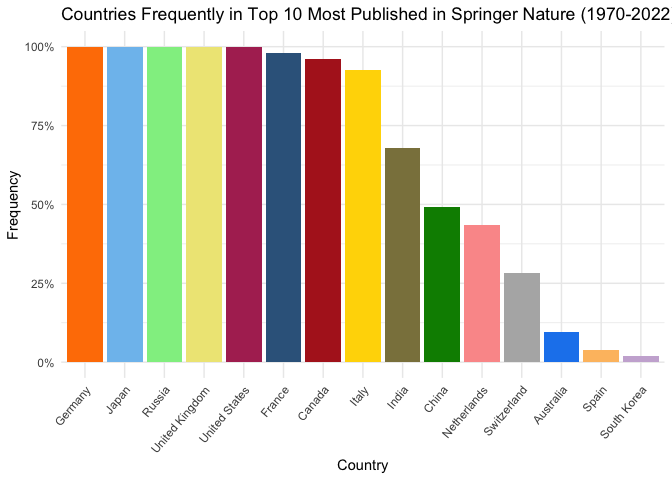
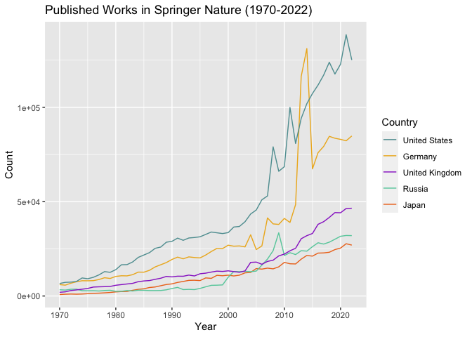
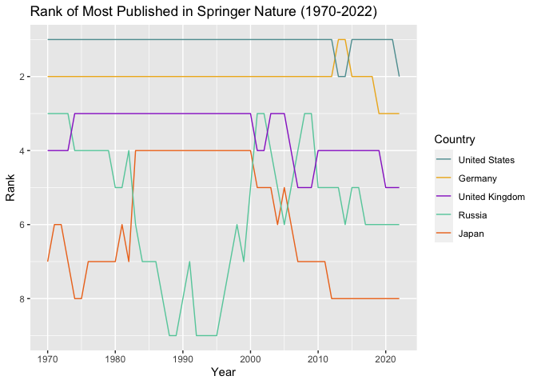
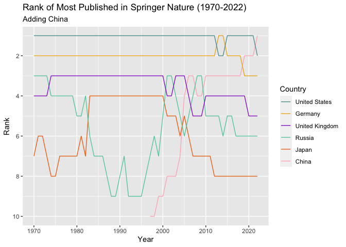
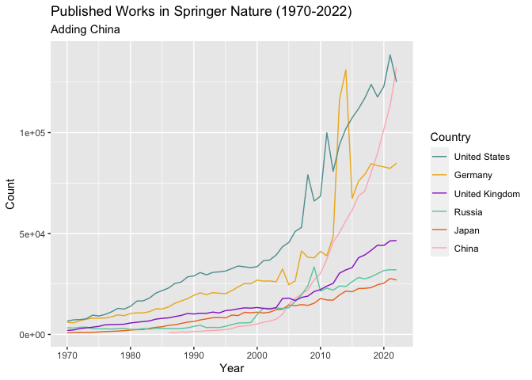
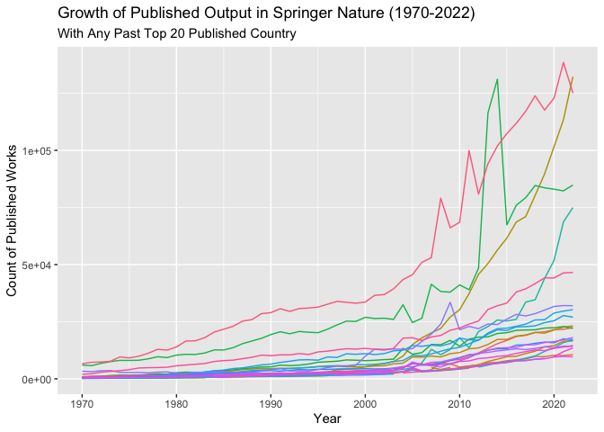
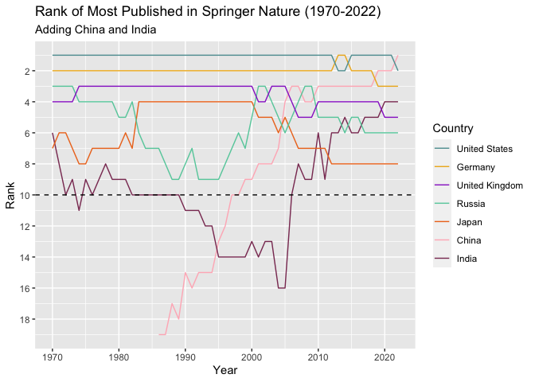

Analyzing Springer Nature Data
================
Quinn Liu

- [The Data](#the-data)
- [The Analysis: What are the countries that have the highest count of
  published works in Springer
  Nature?](#the-analysis-what-are-the-countries-that-have-the-highest-count-of-published-works-in-springer-nature)
  - [How Often Has a Country Been in the Top 10 Countries with the Most
    Published Works in Springer
    Nature?](#how-often-has-a-country-been-in-the-top-10-countries-with-the-most-published-works-in-springer-nature)
  - [Focusing on the Five Dominant Countries: How do they compare to
    each
    other?](#focusing-on-the-five-dominant-countries-how-do-they-compare-to-each-other)
  - [Adding China](#adding-china)
  - [Growth in the Top 20](#growth-in-the-top-20)
  - [Growth of India](#growth-of-india)
- [Summary](#summary)

## The Data

This data is obtained from `springer_API.Rmd.` It contains the top 20
countries with the most published works in Springer Nature from the
years 1970 to 2022, along with the count and rank for each country.

    ## Rows: 1041 Columns: 4
    ## ── Column specification ────────────────────────────────────────────────────────
    ## Delimiter: ","
    ## chr (1): country
    ## dbl (3): published_count, year, rank
    ## 
    ## ℹ Use `spec()` to retrieve the full column specification for this data.
    ## ℹ Specify the column types or set `show_col_types = FALSE` to quiet this message.

    ## # A tibble: 6 × 4
    ##   country        published_count  year  rank
    ##   <chr>                    <dbl> <dbl> <dbl>
    ## 1 United States             6619  1970     1
    ## 2 Germany                   6050  1970     2
    ## 3 Russia                    3311  1970     3
    ## 4 United Kingdom            1968  1970     4
    ## 5 Canada                     887  1970     5
    ## 6 India                      855  1970     6

## The Analysis: What are the countries that have the highest count of published works in Springer Nature?

#### How Often Has a Country Been in the Top 10 Countries with the Most Published Works in Springer Nature?

<!-- -->

From the bar chart, we can see that 5 countries, Germany, Japan, Russia,
the United Kingdom, and the United States have been in the top 10 most
published countries every year for the past 50 years. France, Canada,
and Italy have also been very often in the top 10. India has also been
in the top 10 most published more than 50% of the time. The remaining 6
countries have been in the top 10 less than 50% of the time. China,
Netherlands, and Switzerland are semi-frequent, with frequencies between
25% and 50%, but Australia, Spain, and South Korea are the least
frequently in the top 10. South Korea being the least frequent, has only
been in the top 10 once out of the past 53 years. This occurred in 2005,
and South Korea ranked 10th, but South Korea does appear frequently in
the top 20 most published.

The bar chart does tell us that there are 5 countries that dominate in
terms of most published works in the Springer.

#### Focusing on the Five Dominant Countries: How do they compare to each other?

<!-- -->

<!-- -->

The graph of the ranks tells us that the United States has solidly been
the most published country in Springer since 1970. There are only three
years where the US is not the most country: twice from 2013 to 2014,
where Germany overtook first spot and US fell to second, and in 2022,
where the US fell to second. In 2022, none of the five most dominant
countries in first. Looking at the data, it is China that in first rank.
Germany is solidly in second rank. For almost as often as the US is
first, Germany is second. There is a time around 2020 where Germany
drops from second to third, and looking at the data, this is because
China has taken second spot.

The United Kingdom is usually in third rank but does not hold this spot
as frequently as the US and Germany hold theirs. Before 2010, the UK
only swaps this spot with Russia. After 2010, the United Kingdom drops
to fourth (and then fifth), and it is not Russia who takes the spot
(Russia drops to around sixth). In a similar case to US and Germany
losing their spot, it is because China has overtaken the UK.

Russia and Japan both are not very stable in a certain rank. Both
countries also experience a rise and drop. Russia goes from around
fourth to dropping near ninth about the same time as Japan rises from
around seventh to fourth in the mid-1980s. Russia wavers around the
bottom as Japan stays solidly in fourth until around 2000. Then Russia
rises back up to around third/fourth, and Japan starts dropping down.
While it appears that Japan and Russia’s rises and falls coincide with
each other, no conjecture comes to mind as to why.

Looking at the time series of the count of published works, we can see
that there is a considerable gap in published output between the United
States and the rest of the countries, particularly from 2010 onwards,
with the exception from 2013 to 2014, where Germany has a huge spike in
published works before dropping down. I’m unsure of the cause of the
spike. There is a good gap between the US and Germany and between
Germany and the United Kingdom. These gaps further illustrate the US
being in solid first and Germany in solid second. UK, Russia, and Japan
have publishing counts closer to each other and are a magnitude off from
the US. All countries exhibit positive growth over time. However, in the
1970s, all countries had a similar output. The gap in outputs is then
due to the US’s and Germany’s greater growth than the other three
countries, with the US’s growth also substantially greater than
Germany’s.

#### Adding China

Though the bar charts do not identify China as a long-time dominant
country, the time series do show ripples of China rising through the
ranks. And by adding China to the time series of ranks, we can see the
rise.

<!-- -->

China enters the top 10 ranks in 1997 and has remained in the top 10
ranks. There is a quick rise from tenth to third in the 2010s, one that
looks a lot like Russia’s rise to the top that occurs a couple of years
before China (unsure if there is any relation). China makes its way to
first rank in more recent years. And we can add China to the time series
of published article counts to further observe.

<!-- -->

This graph further confirms that China has been steadily rising quickly
in published output. China appears to face the fastest growth, one that
outpaces US and Germany in the 2010s. In 2022, China and the US have
similar published output. I do not have a strong conjecture as to
China’s growth but it is likely that it is related to China’s economic
growth. In fact, all 6 countries are countries that have large
economies. It is likely that academic productivity correlates to a
country’s economic health.

#### Growth in the Top 20

Though some countries have missing data point in certain years, we can
get a good gauge in growth in academic output for countries that have
been a top 20 published country in Springer Nature.

<!-- -->

Seeing the graph tells us that most countries have output and growth on
a scale similar to Japan and Russia. It does highlight another country
with exceptional growth similar to that of China, albeit smaller and
more recent. Looking at the data, this country is India.

#### Growth of India

<!-- -->

Adding India to the time series of rank tells us that, unlike China,
India has been in the top 10 before its enormous growth in recent years.
This makes sense considering we know from the bar charts of countries’
frequency in the top 10, India, unlike China, has been in the top 10
more than 50% of the time. India fell out of the top 10 near 1990. 1990
to around 2005, India stayed around 15th. This is in comparison to
China, which only entered top 20 in 1986 and has a continuously rising
trend. But in 2005, India experienced an enormous growth, going to 8th
extremely quickly and then rising to its 2022 fourth rank. India, like
China, has also experienced substantial economic growth in recent years,
and its academic growth is likely to also be correlated.

## Summary

Historically, the most published countries in Springer are the US,
Germany, the UK, Russia, and Japan, with the US solidly first and
Germany solidly second. There has been tremendous growth in academic
output from China and India, which have not been historically in the top
5 but have been rising to be comparable to the above countries in the
past decade or 2. France, Canada, and Italy are also commonly in the top
10 most published.

This data is only from Springer Nature, which is only one academic
journal. Springer Nature is a German-British academic publishing
company, which is a factor for Germany and the UK’s status as dominant
publishing countries in this journal. But these general observations
could likely be found in other journals.
