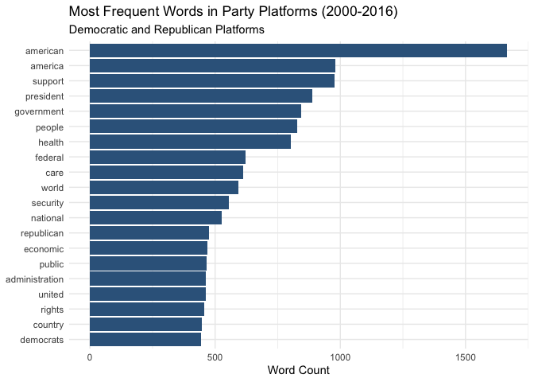
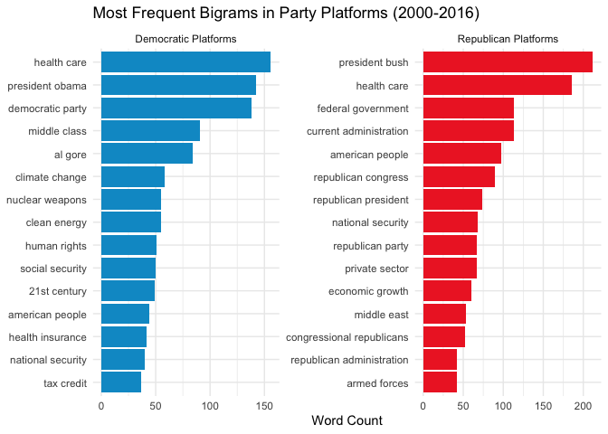
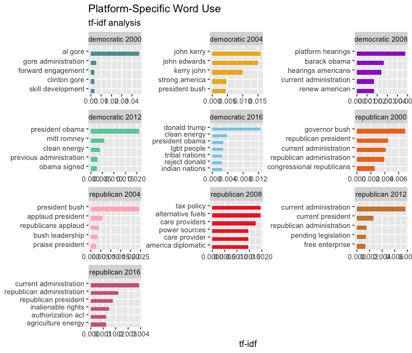
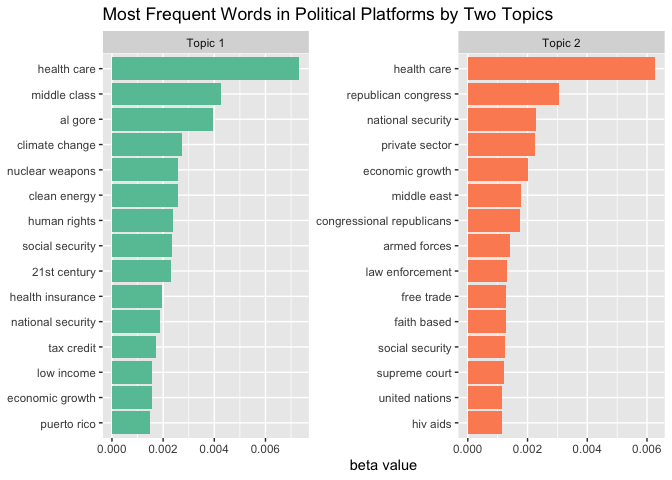

Political Platform Topics
================
Quinn Liu

- [Research Question: What topics make up the U.S. Political Parties’
  Platforms From 2000 to
  2016?](#research-question-what-topics-make-up-the-us-political-parties-platforms-from-2000-to-2016)
  - [Retreiving the Data](#retreiving-the-data)
  - [Exploratory Text Analysis](#exploratory-text-analysis)
    - [Word Frequencies](#word-frequencies)
    - [Tf-idf](#tf-idf)
  - [Topic Modeling](#topic-modeling)
    - [Data Preparation](#data-preparation)
    - [Two Topics](#two-topics)

# Research Question: What topics make up the U.S. Political Parties’ Platforms From 2000 to 2016?

America’s main political parties, the Democratic Party and the
Republican Party, both release platform statements in the cycle with the
presidential elections. Both parties outline the issues the party will
stand for and the political goals they aim for. These platforms
represent both the parties’ interests and their voters interests. The
current political topics appear in the corresponding year’s platforms,
from al-qaeda in the 2000s to COVID in 2020. Using textual analysis on
the party platform statements from the Democratic Party and the
Republican Party from 2000 to 2016, we can see the main issues that the
parties focus and which topics loom the largest in America’s political
conversation.

2020 was not included in this data collection because while there is a
2020 Democratic Platform, the Republican Party simply released a
resolution to not amend the 2016 platform due to restrictions on the
Republic National Convention. To maintain equal proportion between
Democratic and Republican platform issues, 2020 was excluded.

## Retreiving the Data

The platform statements were retrieved from [The American Presidency
Project](https://www.presidency.ucsb.edu/documents/app-categories/elections-and-transitions/party-platforms).
The party platfroms from 2000 to 2016 were scrapped from the website and
then preprocessed into unigrams and bigrams.

The corpus is the platforms, and a single document is a specific
platform released by either the Democratic or the Republican party in a
certain year.

## Exploratory Text Analysis

#### Word Frequencies

<!-- -->

The top 20 most frequent unigrams illustrate common themes in the
general party platform. We can see that the top 2 words are american and
america. These two make sense, as these are American political parties
vying for the American presidency. Their goals are ultimately what they
want for America. The frequency of america could also be influenced by
rhetorics using nationalism. To emphasize the greatness of American or
the American dream are good and common persuasive tactics, and platforms
do more than simply state political goals, they also aim to persuade
voters. “support” could also be influenced by persuasive rhetoric, but
it is also a obvious word to use when stating stances on issues. There
are other ‘obvious’ words, such as president, government,
administration, and country. They all refer to the U.S. and politics and
do not tell us more than knowing this is a political platform would.
Looking at through the corpus, president and administration is commonly
use to refer to accomplishments or failures of the current president
(depending on if the President was of the party). It seems political
parties use the current administrations work to persuade voters,
supporting a conceptualization of a presidential election with a sitting
president as a vote of satisfaction with the current president.

Some frequent words illustrate a more specific topic, such as health,
rights, economic, security and education. From 2000 to 2016, it seems
that these are the most frequently discussed issues. Security is likely
due to 9/11 and ensuing issues from it. “Families” indicates that the
core demographic appealed to is the American family, which is a large
category, one that is very widely applicable. Though, families could be
a more specific call to a nuclear family but more context would be
needed. “Care” would also require more context, but seeing as health is
another top word, care is likely used as health care. Being seeing a
scarcity of more specific topics in the top unigrams, observing bigrams
will likely tell us more. It may also be more illuminating to separate
out words by party and see which topics each party focused more on and
compare.

<!-- -->

Health care is the top democrat word and the second top republican word,
making it the most dicussed issue across both parties. For Democratic
Platforms, health insurance is specifically mentioned a lot too. The
other main issue is seen in the smattering of words that come from 9/11
and ensuing issues, like middle east and armed forces from Republicans,
and nuclear weapons from Democrats, and national security from both. It
is interesting to see which particular sub-topics within 9/11 and the
conflict in middle east both parties focus on. The third topic seen is
the economy: Democrat’s middle class and tax credit, and Republican’s
economic growth and private sector. It seems that within the issue of
the U.S. economy, Democrats and Republicans focus on different
demographics, middle class vs private sector.

Democratic Platforms also have clean energy and human rights as top
words, while the Republican Platforms have a lot more “obvious political
words” like federal government, republican party, congressional
republicans. Democratic Platforms’ most frequent words are also more
frequent than Republican Platforms’ most frequent. Doing word counts, we
can see that Democratic Platforms tend to be longer than Republican
Platforms. Thus, the greater word frequency in Democratic Platforms may
be due to sheer size.

Since we see more specific topics in bigrams, I will be only observing
bigrams from here on out.

#### Tf-idf

<!-- -->

Observing the highest tf-idf words for each platform illustrates that
there are not a lot of words pertinent to only that specific platform,
as the tf-idf values are not particularly high. Though there are some
topics that show up like lgbt people for Democrats in 2016 and tax
policy for Republicans in 2008, the words with the highest tf-idf values
seem to be of head-runner politicians of that party that year, for
example, Al Gore for Democrats in 2000, and John Kerry and John Edwards
for Democrats im 2004, and Bush for republicans in 2000 and 2004.
President Obama and Donald Trump are pertinent to Democrats in 2012 and
2016 respectively, and while they were dominant in their election years,
it is interesting that the republicans did not use their names as often.
Instead, in 2012 and 2016, the republicans used “current
administration,” referring to Obama, more.

## Topic Modeling

I will be doing a topic modeling because platforms are by their nature
built to contain certain topics and the political party’s stance on
them, and topic modeling allows us to examine documents based on the
themes and topics present in them. And since the research question also
asks for platform trends, it inherently makes sense to do a topic
modeling, as we are looking after platforms topics. And while topic
modeling fails to capture whether two party has the same stance on an
issue, since both parties discussing the same topic on their platform
does not mean they have the same sentiment, sentiment analysis would not
be well-suited for this either. Sentiment analysis would allow us to
capture whether the langauge used in positive or negative, but political
parties will often positive or neutral language for their stances, as
political parties would like to persuade voters, and topics are not
typically expressed in obvious sentiment language. Saying “we will cut
taxes” is positive or negative depending on the voter. Further, it is
unlikely to see a change in sentiment for a topic from year to year,
whereas the salient topics dicussed are more likely to change, allowing
topic modeling to tell us more less-obvious information than sentiment
analysis.

#### Data Preparation

Word frequency analysis has illustrated that a lot of the reoccurring
words refer to the president, the administration, the government, or
americans. These topics call to the general country and government and
are obvious considering these are U.S. political platforms. Since the
interest is in more specific platform topics, I will be filtering out
such words.

Since the text is currently in tidy text format, I will also convert the
data into a document-term-matrix.

#### Two Topics

I will then use document-term-matrix and fit a LDA topic model with it.

Since the corpus can be divided between party lines, a model with 2
topics can give us topics that divide this party line.

<!-- -->

Both topics have health care as their most common word. This indicates
that the two topics extracted are very similar to each other. Observing
the rest of the words, there are other repeat words like 21st century,
human rights, economic growth, national security, climate change, and
nuclear weapons. This could indicate that the corpus as a whole is very
similar, and all platforms focus on similar topics overall, and there is
little to differentiate. The low tf-idf values found previously also
support this. Climate change is a new word not previously seen in word
frequencies or tf-idf words, though its content is likely connected to
clean energy. Topic 1 has wall street, and Topic 2 has hiv aids and law
enforcement. Wall street could be connected to the general economy but
could also speak to “Occupy Wall Street.”

The overlap in words makes it hard to determinate which topic is more
Democrat and which is more Republican. It seems that both parties have
platforms that discuss similar topics, and instead, there difference
lies in their stance on these topics. Topic 2’s “republican congress”
and Topic 1’s “al gore” likely means that Topic 1 is more Democratic and
Topic 2 is more Republican. Extending this, “tax cuts” and “tax credit”
would be a more Democratic topics and “law enforcement” and “private
sector” are more Republican topics, but this is not a very strong
conclusion.
